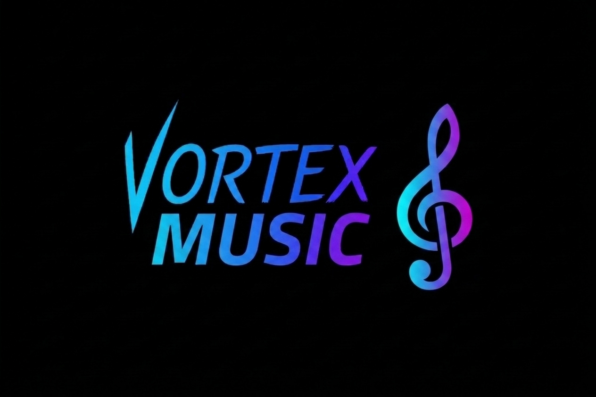

# VortexMusic

<div align="center">

  

  <h3>Discord music bot with Lavalink multi-node, discord.js, and Components V2</h3>

  <p>
    A clean, multi-server music bot built for reliable playback, modular slash commands, and a modern Discord UI.
  </p>

  <p>
    <a href="https://github.com/vortexdevelopmentgit/VortexMusic/stargazers"></a>
    <a href="https://github.com/vortexdevelopmentgit/VortexMusic/network/members"></a>
    <a href="https://github.com/vortexdevelopmentgit/VortexMusic/issues"></a>
    <a href="https://github.com/vortexdevelopmentgit/VortexMusic/blob/main/LICENSE"></a>
  </p>

</div>

---

## Overview

VortexMusic is a Discord music bot powered by `discord.js` and `Lavalink`, designed for multi-server playback with isolated guild state, modular slash commands, and a Components V2 player panel.

It is built to stay simple operationally while still supporting the features you actually need in production:

- Multi-server playback
- Multi-node Lavalink support
- Components V2 player panel
- Slash command architecture
- Queue tools and playback controls
- English-only command and UI text

## Features

- Multi-guild player state
  Each server gets its own queue, player state, volume, and controller panel.

- Lavalink multi-node support
  Configure one or more nodes in `config/nodes.js` and let the bot use them for playback.

- Components V2 interface
  The player panel is built with Discord Components V2 instead of legacy embed-first layouts.

- Modular commands
  Commands are split into standalone modules to keep the project maintainable.

- Queue management
  Built-in support for queue display, shuffle, remove, clear, and loop modes.

- Automatic slash command deployment
  Commands are deployed automatically when the bot starts.

## Commands

### Playback

- `/play` - Play a song or add tracks to the queue
- `/pause` - Pause the current track
- `/resume` - Resume playback
- `/stop` - Stop playback and disconnect from voice
- `/nowplaying` - Show the current player panel
- `/volume` - Set the player volume

### Queue

- `/queue` - Show the current queue
- `/shuffle` - Shuffle queued tracks
- `/clear` - Clear the queue
- `/remove` - Remove a track from the queue by position
- `/loop` - Set loop mode to `off`, `track`, or `queue`

### Utility

- `/help` - Show the command list

## Project Structure

```txt
VortexMusic/
├─ config/
│  └─ nodes.js
├─ src/
│  ├─ commands/
│  │  ├─ modules/
│  │  └─ index.js
│  ├─ components/
│  │  └─ playerPanel.js
│  ├─ lavalink/
│  │  ├─ musicManager.js
│  │  └─ nodes.js
│  ├─ utils/
│  │  ├─ formatters.js
│  │  ├─ logger.js
│  │  └─ respond.js
│  ├─ config.js
│  ├─ deploy-commands.js
│  └─ index.js
├─ .env.example
├─ package.json
└─ README.md
```

## Installation

### Requirements

- Node.js `20+`
- A Discord bot application
- At least one working Lavalink node

### Setup

1. Clone the repository.
2. Install dependencies.
3. Create your `.env` file.
4. Configure your Lavalink nodes.
5. Start the bot.

```bash
npm install
npm run start
```

## Environment Variables

Copy `.env.example` to `.env` and configure the following values:

```env
DISCORD_TOKEN=
DISCORD_CLIENT_ID=
```

### Variable Notes

- `DISCORD_TOKEN`
  Your Discord bot token.

- `DISCORD_CLIENT_ID`
  Your Discord application ID.

## Running The Bot

```bash
npm start
```

On startup the bot will:

- connect to Discord
- connect to configured Lavalink nodes
- deploy slash commands automatically
- start listening for interactions

## NPM Scripts

```bash
npm start
npm run dev
npm run deploy
npm run check
```

## Notes

- `stop` also disconnects the bot from voice.
- The player panel uses Components V2.
- Global slash command deployment can take time to propagate.
- Lavalink source support depends on the plugins enabled on your nodes.

## Security

If your Discord bot token has ever been exposed, rotate it immediately in the Discord Developer Portal and update your `.env`.

## Contributing

If you want to improve the bot, keep changes consistent with the current architecture:

- modular commands
- centralized music state handling
- Components V2 responses
- English-only public text

## License

This Code is Protected by VortexDevelopment License

---

<div align="center">
  Built by VortexDevelopment. ❤️
</div>
